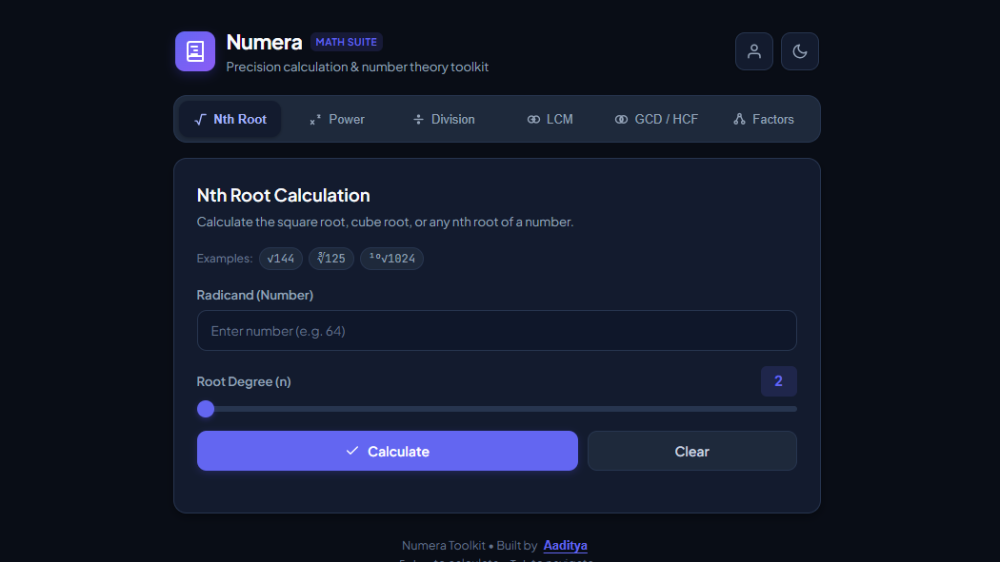

# Numera — Modern Mathematical Toolkit

A fast, distraction-free precision mathematical calculation suite designed with clean aesthetics, instant feedback, and intuitive usability.

## Preview



## Overview

**Numera** replaces cumbersome calculators with a streamlined, client-side toolkit for arithmetic operations and number theory.

## Features

1. **Nth Root Calculation**
   - Calculate square roots, cube roots, and any $n^{\text{th}}$ root.
   - Interactive live slider and degree stepper (2 to 10).
   - Accurate decimal and negative odd-root support.

2. **Power & Exponentiation**
   - Calculate powers with positive, negative, and fractional exponents ($x^y$).
   - Precision handling and clean scientific notation output.

3. **Euclidean Division**
   - Calculates integer quotient and remainder simultaneously.
   - Provides instant algebraic verification ($a = b \times q + r$).
   - Zero divisor guard and negative integer support.

4. **Least Common Multiple (LCM)**
   - Calculates LCM for multiple numbers simultaneously.
   - Flexible input delimiters (commas, spaces, semicolons).

5. **Highest Common Factor (HCF / GCD)**
   - Computes the greatest common divisor using the Euclidean algorithm.
   - Supports multiple numbers simultaneously.

6. **Factors & Prime Canonical Factorization**
   - Computes all integer divisors with count badge.
   - Canonical prime power decomposition (e.g. $360 = 2^3 \times 3^2 \times 5^1$).

## User Experience & Design

- **Themes**: Seamless Light and Dark mode with persistence and system preference detection.
- **Fast Tab Navigation**: Switch between calculation tools instantly with no page reloads.
- **Instant Testing**: One-click "Try Example" chips for every tool.
- **Keyboard Friendly**: Press `Enter` to calculate immediately.
- **Typography**: Paired with `Plus Jakarta Sans` for clean UI and `JetBrains Mono` for crisp mathematical precision.

## Getting Started

### Prerequisites
- Any modern web browser (Chrome, Firefox, Safari, Edge).
- No build steps or external dependencies required.

### Running Locally
1. Clone or download this repository.
2. Open `index.html` directly in your browser.

## File Structure

```
├── index.html       # Semantic HTML layout with tabs & SVG icons
├── styles.css       # Design system tokens, light/dark themes & responsive styling
├── script.js        # Mathematical engines, theme switcher, and UI interactions
└── README.md        # Documentation
```

## License

This project is open source and available under the [MIT License](LICENSE).
